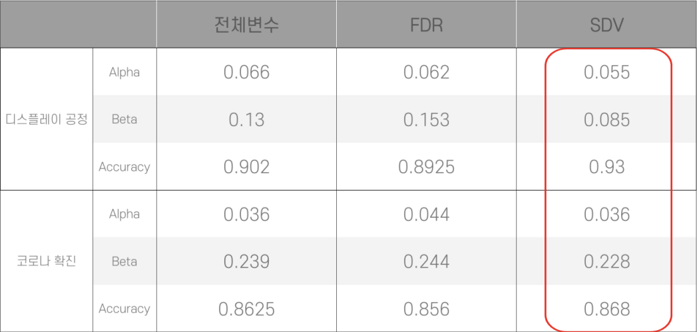

# Capstone

    

본 작품은 [한국공학대학교 경영학부](https://www.tukorea.ac.kr/biz/index.do) 2022 Capstone Design 졸업 작품입니다.

## 작품 소개
- 이상 감지 모델(Anomaly Dectection Model)은 흔히 공정 단계에서 생산되는 데이터를 정상 혹은 이상으로 판단하는 역할을 한다. 그러나 불필요한 입력 변수가 존재하게 되면 모델의 성능과 정확도에 부정적인 영향을 미치므로 변수선택법을 적용하여 유의미한 변수들 만으로 모델을 구축하고 성능과 정확도를 높이고자 하였습니다.
- Mahalanobis distance 기반 이상 감지 모델인 Hotelling's T-square를 활용하여 다변량 Dataset을 빠르게 계산하도록 하였습니다.
- 순위결정방법(Ranking Method) FDR(False Discovery Rate)와 SDV(Stochastic Dissimilarity Vector)을 사용하여 성능을 높이고자 하였고 이를 Grafana Dashboard를 통해 시각화하여 자체 프로그램이 존재하지 않는 중소기업들도 쉽게 이상감지 서비스를 활용할 수 있도록 하였습니다.

## 개발 기간
- 2022.02 ~ 2022.04: 1차 개발
- 2022.05: 중간 발표
- 2022.06 ~ 2022.08: 2차 개발
- 2022.09: 최종 발표

## SDV Algorithm 작동 원리
- SDV의 작동원리는 다음 사진과 같습니다.

    

## FDR과 SDV Selection의 성능 비교
- 디스플레이 공정 데이터와 코로나 확진 데이터의 FDR과 SDV Selection을 적용한 이상감지 모델의 Alpha error, Beta error, Accuracy는 다음과 같습니다.

    

## 기대효과 및 시장성
- 이상을 감지하는데 있어 어떤 변수가 이상의 원인인지 판단 할 수 있다.
- 대시보드 모니터링을 통해 누구나 쉽고 빠르게 이상감지가 가능하다.
- 라벨링된 데이터라면 공정 데이터 이외에 제품 품질, 의학, 금융등 다양한 분야에서 적용이 가능하다.

## 문의
코드 및 발표자료에 대해 궁금한 점이 있으실 경우 lhk6565@naver.com으로 문의해주시면 답변드리겠습니다.:blush: 
SDV(Stochastic Dissimilarity Vector) 알고리즘 원리는 김상기, 김용민, 강지훈, ["확률적 비유사성 벡터를 활용한 변수선택기법"](https://www.dbpia.co.kr/journal/articleDetail?nodeId=NODE10538658), 신뢰성응용연구, Vol.21, No1, pp.61-68, Mar.2021 (KCI)에 자세히 나와있으니 참고바랍니다.